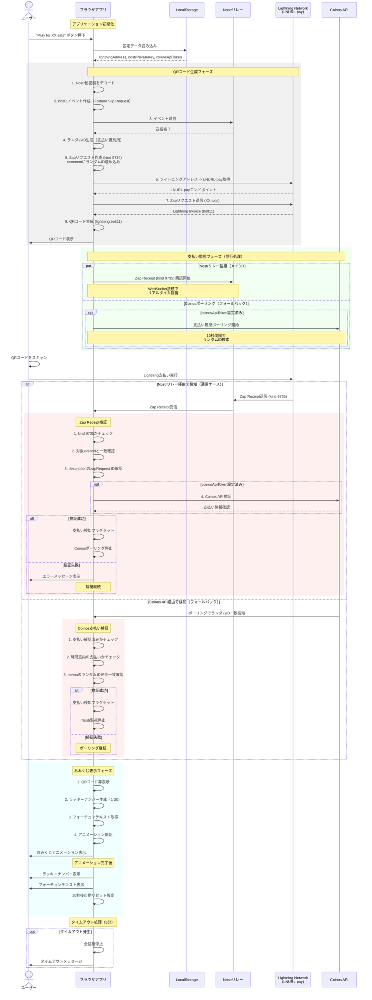

# Nostr Fortune Slip 支払いフロー

このドキュメントでは、Nostr Fortune Slipアプリケーションにおける、QRコード表示から支払い受取、おみくじ表示までの処理フローをシーケンス図で示します。

## 概要

このアプリケーションは以下の特徴を持ちます：

- **デュアル検知システム**: Nostrリレーでのリアルタイム監視とCoinos APIポーリングによるフォールバック
- **支払い検証**: Zap Receipt（kind 9735）の厳密な検証とCoinos API検証
- **ランダムID追跡**: 支払いを一意に識別するためのランダムIDを生成・追跡

## シーケンス図



## 主要コンポーネント

### 1. QRコード生成プロセス

1. **Nostrイベント作成**: kind 1（テキストノート）としてFortune Slip Requestを作成
2. **Zapリクエスト生成**: kind 9734イベントとして支払い要求を作成
3. **Lightning Invoice取得**: LNURL-payプロトコルでインボイスを取得
4. **QRコード表示**: `lightning:` プレフィックス付きでQRコード生成

### 2. デュアル監視システム

#### Nostrリレー監視（メイン）
- **WebSocket接続**: リアルタイムでZap Receipt（kind 9735）を監視
- **厳密な検証**: 対象eventId、zapRequest IDの完全一致確認
- **Coinos API連携**: 追加の支払い検証（オプション）

#### Coinos APIポーリング（フォールバック）
- **定期ポーリング**: 10秒間隔で支払い履歴をチェック
- **ランダムID追跡**: memoフィールド内のランダムIDで支払いを特定
- **時間窓制御**: ポーリング開始前後10分の範囲で支払いを検索

### 3. 支払い検証プロセス

#### Zap Receipt検証（NIP-57準拠）
```typescript
// 主要な検証項目
- kind === 9735
- bolt11タグ存在
- descriptionタグ存在
- eタグが対象eventIdと一致
- descriptionのzapRequest IDが一致
```

#### Coinos API検証
```typescript
// 主要な検証項目  
- payment.confirmed === true
- 時間窓内の支払い（前後10分）
- memo内のランダムID完全一致
```

### 4. エラーハンドリング

- **ネットワークエラー**: リレー接続失敗、API通信エラー
- **検証エラー**: Zap Receipt不正、Coinos支払い検証失敗
- **タイムアウト**: 5分経過での自動停止
- **設定エラー**: 必須設定項目の不備

## 技術仕様

- **支払い金額**: デフォルト100 sats（設定可能）
- **ランダムID**: Base64エンコード済み8バイト値
- **監視タイムアウト**: 5分間
- **ポーリング間隔**: 10秒
- **自動リセット**: おみくじ表示後20秒
- **ラッキーナンバー範囲**: 1-20（設定可能）

## セキュリティ考慮事項

1. **支払い検証の二重化**: NostrとCoinos両方での検証
2. **ランダムID**: 支払いの一意性確保
3. **時間窓制御**: 古い支払いの誤検知防止
4. **厳密なマッチング**: 完全一致による検証

## 参考リンク

- [NIP-57: Lightning Zaps](../docs/nips/57.md)
- [LUD-06: payRequest base spec](../docs/luds/06.md) 
- [LUD-16: Internet Identifier](../docs/luds/16.md)
- [設計ドキュメント](./design.md)
