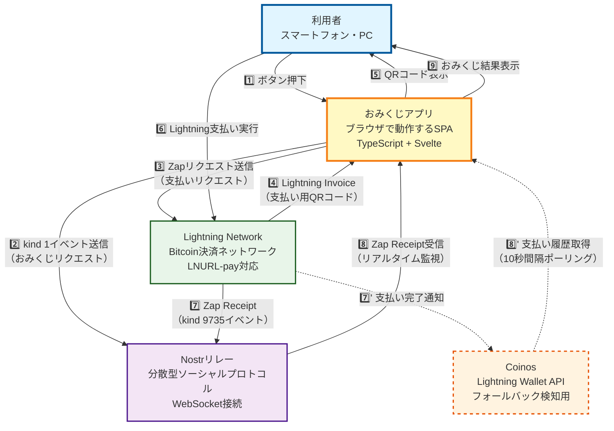

# Nostr Fortune Slip システム構成図

このドキュメントでは、Nostr Fortune Slipアプリケーションのシステム全体構成と各コンポーネント間の関係性を図で示します。

## システム概要

Nostr Fortune Slipは、Lightning NetworkとNostrプロトコルを組み合わせた分散型おみくじアプリケーションです。中央サーバーを必要とせず、ブラウザ単体で動作し、複数のバックエンドサービスと連携して支払いを検知します。

## システム構成図



## コンポーネント詳細

### 利用者（User）
**役割**: アプリケーションを利用してお金を支払い、おみくじを引く

**操作**:
- ブラウザでアプリを開く
- 「Pray for XX sats」ボタンを押す
- QRコードをスキャンして支払い
- おみくじ結果を受け取る

**必要なもの**: 
- インターネット接続
- Lightning対応ウォレット（QRコードスキャン機能付き）

---

### おみくじアプリ（Browser App）
**役割**: すべての処理を統括するフロントエンドアプリケーション

**技術スタック**:
- TypeScript + Svelte
- Nostr Tools ライブラリ
- QRコード生成ライブラリ

**主な機能**:
1. **イベント生成**: Nostr kind 1イベント、Zapリクエスト（kind 9734）を作成
2. **QRコード生成**: Lightning Invoiceから支払い用QRコードを生成
3. **支払い監視**: デュアルシステムで支払いを検知
   - Nostrリレーからのリアルタイム受信（メイン）
   - Coinos APIポーリング（フォールバック）
4. **結果表示**: ラッキーナンバーとおみくじテキストを表示

**データ保存**: LocalStorage（設定情報のみ、秘密鍵を含む）

---

### Nostrリレー（Nostr Relay）
**役割**: 分散型イベント配信システム

**プロトコル**: Nostr（Notes and Other Stuff Transmitted by Relays）

**このアプリでの用途**:
- **イベント保存**: おみくじリクエスト（kind 1）を保存
- **Zap Receipt配信**: 支払い完了通知（kind 9735）をリアルタイム配信
- **WebSocket接続**: アプリとの常時接続で即座に通知

**特徴**:
- 中央サーバー不要の分散型
- 複数のリレーを並行利用可能
- 検閲耐性

---

### Lightning Network
**役割**: Bitcoin高速決済ネットワーク

**プロトコル**: 
- LNURL-pay（LUD-06, LUD-16）
- Lightning Invoice（bolt11）

**このアプリでの用途**:
1. **LNURL-payエンドポイント提供**: ライトニングアドレスから決済エンドポイントを取得
2. **Invoice生成**: 支払い用のLightning Invoiceを生成
3. **支払い処理**: 実際の支払いトランザクションを処理
4. **Zap Receipt送信**: 支払い完了後、Nostrリレーにkind 9735イベントを送信

**特徴**:
- 秒単位での決済確定
- 低手数料（数satoshi）
- マイクロペイメント対応

---

### Coinos（Fallback System）
**役割**: 支払い検知のフォールバックシステム

**提供サービス**: Lightning Wallet API

**このアプリでの用途**:
- **支払い履歴取得**: 定期的に支払い履歴をチェック
- **ランダムID照合**: 支払いmemoフィールドから識別IDを検索
- **フォールバック検知**: Nostrリレー経由で検知できなかった場合の代替手段

**ポーリング仕様**:
- 間隔: 10秒
- タイムアウト: 5分
- 検索範囲: 過去10分の時間窓

**使用条件**: 
- Coinos APIトークン設定済みの場合のみ有効（オプション）
- 点線で表示（オプショナル機能）

---

## データフロー

### 通常フロー（Nostr経由）

```
1. 利用者 → アプリ: ボタン押下
2. アプリ → Nostrリレー: おみくじリクエスト送信（kind 1）
3. アプリ → Lightning Network: Zapリクエスト送信（kind 9734）
4. Lightning Network → アプリ: Lightning Invoice返却
5. アプリ → 利用者: QRコード表示
6. 利用者 → Lightning Network: 支払い実行
7. Lightning Network → Nostrリレー: Zap Receipt送信（kind 9735）
8. Nostrリレー → アプリ: Zap Receipt受信（WebSocket）
9. アプリ → 利用者: おみくじ結果表示
```

### フォールバックフロー（Coinos経由）

```
1～6. （通常フローと同じ）
7'. Lightning Network → Coinos: 支払い完了通知
8'. アプリ → Coinos: 支払い履歴ポーリング（10秒間隔）
     Coinos → アプリ: 該当支払いが見つかれば返却
9. アプリ → 利用者: おみくじ結果表示
```
